# 🧪 **In-Class Assignment: Build a Minimal E-Commerce Backend API**

Complete assignment document with ER diagrams, architecture, and implementation guide.

---

## 🎯 **Objective**

Students must build a minimal e-commerce backend system using Spring Boot where:

- ✅ Products can be listed
- ✅ Users can add items to cart
- ✅ Orders can be placed
- ✅ Payments can be processed (Razorpay OR mock service)
- ✅ Order status updates after payment
- ✅ APIs must be tested using Postman

**This assignment contributes to final grading.**

---

## 🏗️ **Architecture Overview**

### **High-Level Architecture**

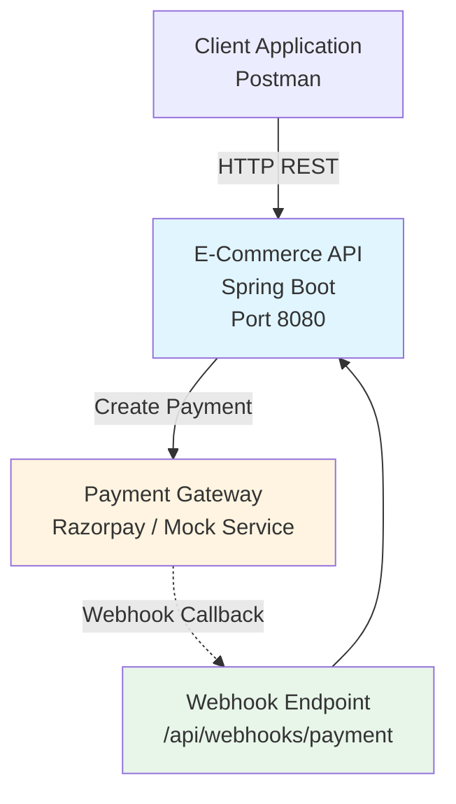

**Key Components:**

- E-Commerce API: Main application
- Payment Gateway: External payment service
- Webhook Endpoint: Receives payment callbacks

---

## 📊 **ER Diagram - Database Schema**

### **Entity Relationship Diagram**

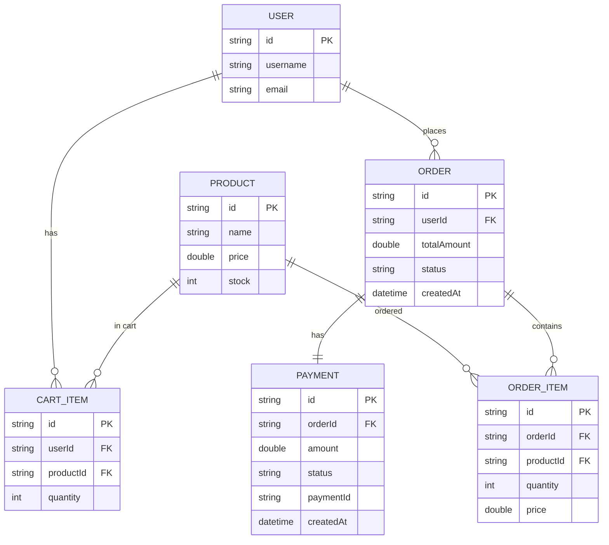

---

## 📋 **Entity Details**

### **1. USER Entity**

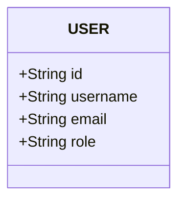

**Fields:**

- `id` (String, Primary Key)
- `username` (String)
- `email` (String)
- `role` (String) - Optional

---

### **2. PRODUCT Entity**

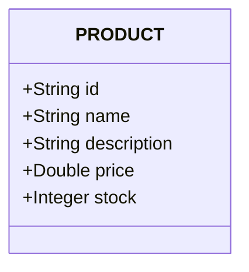

**Fields:**

- `id` (String, Primary Key)
- `name` (String)
- `description` (String) - Optional
- `price` (Double)
- `stock` (Integer)

---

### **3. CART_ITEM Entity**

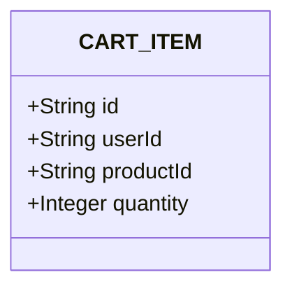

**Fields:**

- `id` (String, Primary Key)
- `userId` (String, Foreign Key → USER)
- `productId` (String, Foreign Key → PRODUCT)
- `quantity` (Integer)

---

### **4. ORDER Entity**

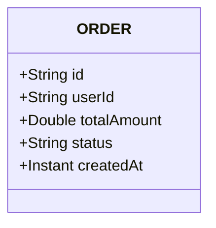

**Fields:**

- `id` (String, Primary Key)
- `userId` (String, Foreign Key → USER)
- `totalAmount` (Double)
- `status` (String) - CREATED, PAID, FAILED, CANCELLED
- `createdAt` (Instant)

---

### **5. ORDER_ITEM Entity**

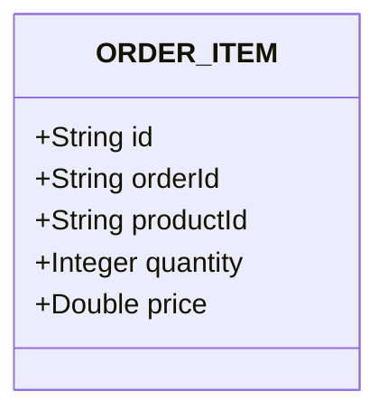

**Fields:**

- `id` (String, Primary Key)
- `orderId` (String, Foreign Key → ORDER)
- `productId` (String, Foreign Key → PRODUCT)
- `quantity` (Integer)
- `price` (Double) - Price at time of order

---

### **6. PAYMENT Entity**

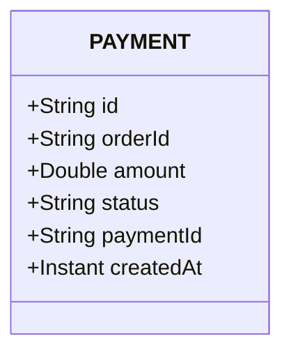

**Fields:**

- `id` (String, Primary Key)
- `orderId` (String, Foreign Key → ORDER)
- `amount` (Double)
- `status` (String) - PENDING, SUCCESS, FAILED
- `paymentId` (String) - External payment ID
- `createdAt` (Instant)

---

## 🔗 **Relationship Diagram**

### **Visual Relationships**

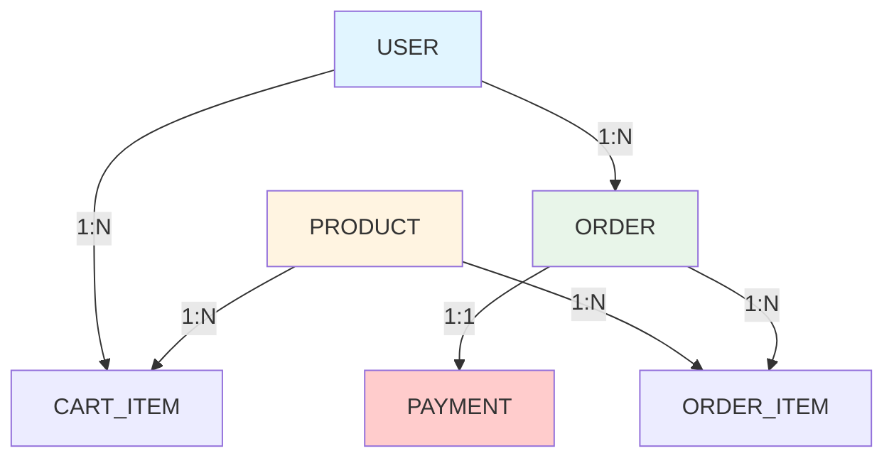

**Relationships:**

- USER → CART_ITEM (1:N) - One user has many cart items
- USER → ORDER (1:N) - One user places many orders
- PRODUCT → CART_ITEM (1:N) - One product can be in many carts
- PRODUCT → ORDER_ITEM (1:N) - One product can be in many orders
- ORDER → PAYMENT (1:1) - One order has one payment
- ORDER → ORDER_ITEM (1:N) - One order has many items

---

## 📁 **Recommended Folder Structure**

```
com.example.ecommerce
│
├── controller
│   ├── ProductController.java
│   ├── CartController.java
│   ├── OrderController.java
│   └── PaymentController.java
│
├── service
│   ├── ProductService.java
│   ├── CartService.java
│   ├── OrderService.java
│   └── PaymentService.java
│
├── repository
│   ├── ProductRepository.java
│   ├── CartRepository.java
│   ├── OrderRepository.java
│   └── PaymentRepository.java
│
├── model
│   ├── User.java
│   ├── Product.java
│   ├── CartItem.java
│   ├── Order.java
│   ├── OrderItem.java
│   └── Payment.java
│
├── dto
│   ├── AddToCartRequest.java
│   ├── CreateOrderRequest.java
│   ├── PaymentRequest.java
│   └── PaymentWebhookRequest.java
│
├── webhook
│   └── PaymentWebhookController.java
│
├── client
│   └── PaymentServiceClient.java   (if mock service used)
│
├── config
│   └── RestTemplateConfig.java
│
└── EcommerceApplication.java
```

---

## 📌 **Mandatory APIs to Implement**

### **1. Product APIs**

#### **POST /api/products**

**Create a new product**

**Request:**

```json
{
  "name": "Laptop",
  "description": "Gaming Laptop",
  "price": 50000.0,
  "stock": 10
}
```

**Response:**

```json
{
  "id": "prod123",
  "name": "Laptop",
  "description": "Gaming Laptop",
  "price": 50000.0,
  "stock": 10
}
```

#### **GET /api/products**

**Get all products**

**Response:**

```json
[
  {
    "id": "prod123",
    "name": "Laptop",
    "price": 50000.0,
    "stock": 10
  }
]
```

---

### **2. Cart APIs**

#### **POST /api/cart/add**

**Add item to cart**

**Request:**

```json
{
  "userId": "user123",
  "productId": "prod123",
  "quantity": 2
}
```

**Response:**

```json
{
  "id": "cart123",
  "userId": "user123",
  "productId": "prod123",
  "quantity": 2
}
```

#### **GET /api/cart/**

**Get user's cart**

**Response:**

```json
[
  {
    "id": "cart123",
    "productId": "prod123",
    "quantity": 2,
    "product": {
      "id": "prod123",
      "name": "Laptop",
      "price": 50000.0
    }
  }
]
```

#### **DELETE /api/cart//clear**

**Clear user's cart**

**Response:**

```json
{
  "message": "Cart cleared successfully"
}
```

---

### **3. Order APIs**

#### **POST /api/orders**

**Create order from cart**

**Request:**

```json
{
  "userId": "user123"
}
```

**Response:**

```json
{
  "id": "order123",
  "userId": "user123",
  "totalAmount": 100000.0,
  "status": "CREATED",
  "items": [
    {
      "productId": "prod123",
      "quantity": 2,
      "price": 50000.0
    }
  ]
}
```

#### **GET /api/orders/**

**Get order details**

**Response:**

```json
{
  "id": "order123",
  "userId": "user123",
  "totalAmount": 100000.0,
  "status": "PAID",
  "payment": {
    "id": "pay123",
    "status": "SUCCESS",
    "amount": 100000.0
  },
  "items": [...]
}
```

---

### **4. Payment APIs**

#### **Option A: Razorpay Integration**

**POST /api/payments/create**
**Create payment for order**

**Request:**

```json
{
  "orderId": "order123",
  "amount": 100000.0
}
```

**Response:**

```json
{
  "paymentId": "pay_razorpay123",
  "orderId": "order123",
  "amount": 100000.0,
  "status": "PENDING",
  "razorpayOrderId": "order_xyz"
}
```

**POST /api/webhooks/payment**
**Receive payment webhook from Razorpay**

**Request (from Razorpay):**

```json
{
  "event": "payment.captured",
  "payload": {
    "payment": {
      "id": "pay_razorpay123",
      "order_id": "order_xyz",
      "status": "captured"
    }
  }
}
```

---

#### **Option B: Mock Payment Service**

**POST /api/payments/create**
**Create payment for order**

**Request:**

```json
{
  "orderId": "order123",
  "amount": 100000.0
}
```

**Response:**

```json
{
  "paymentId": "pay_mock123",
  "orderId": "order123",
  "amount": 100000.0,
  "status": "PENDING"
}
```

**Note:** Mock service will automatically call webhook after 3 seconds.

---

## 🔄 **Order Flow (Business Logic)**

### **Complete Order Flow Diagram**

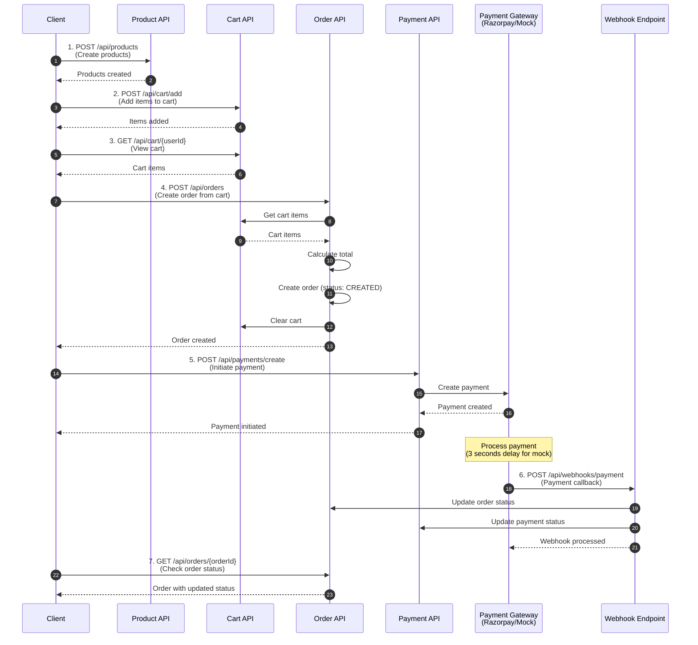

---

## 💳 **Payment Integration Options**

### **Option 1: Razorpay Integration (Bonus Points)**

#### **Architecture**

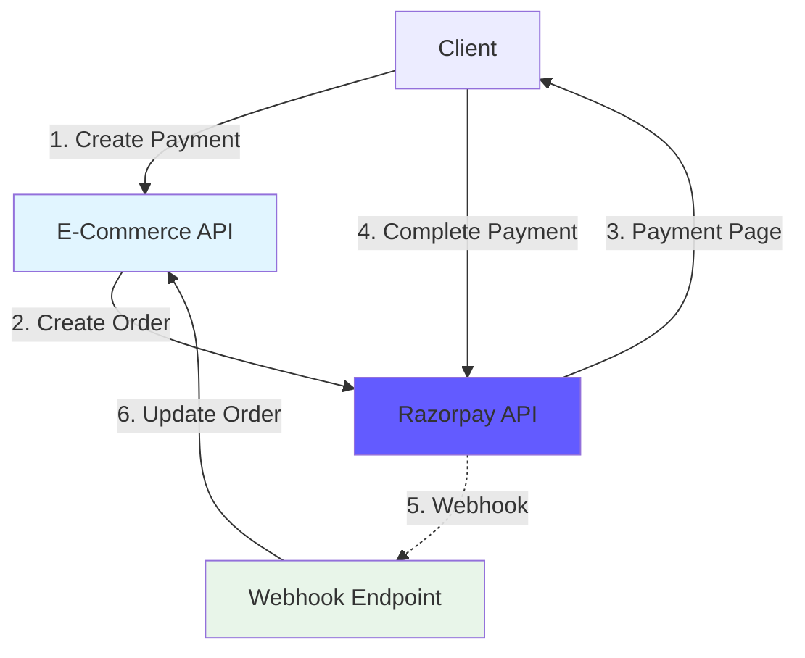

**Steps:**

1. Create Razorpay order
2. Redirect user to Razorpay payment page
3. User completes payment
4. Razorpay sends webhook
5. Update order status

**Bonus Points:** +10 points for Razorpay integration

---

### **Option 2: Mock Payment Service (Standard)**

#### **Architecture**

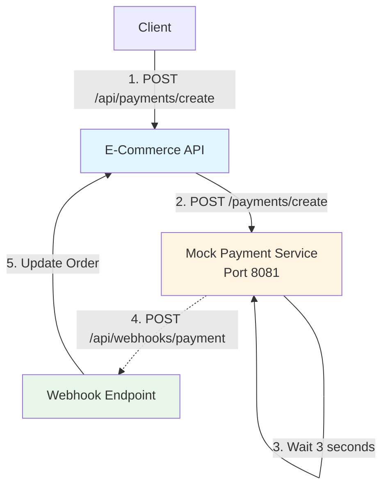

**Mock Payment Service Flow:**

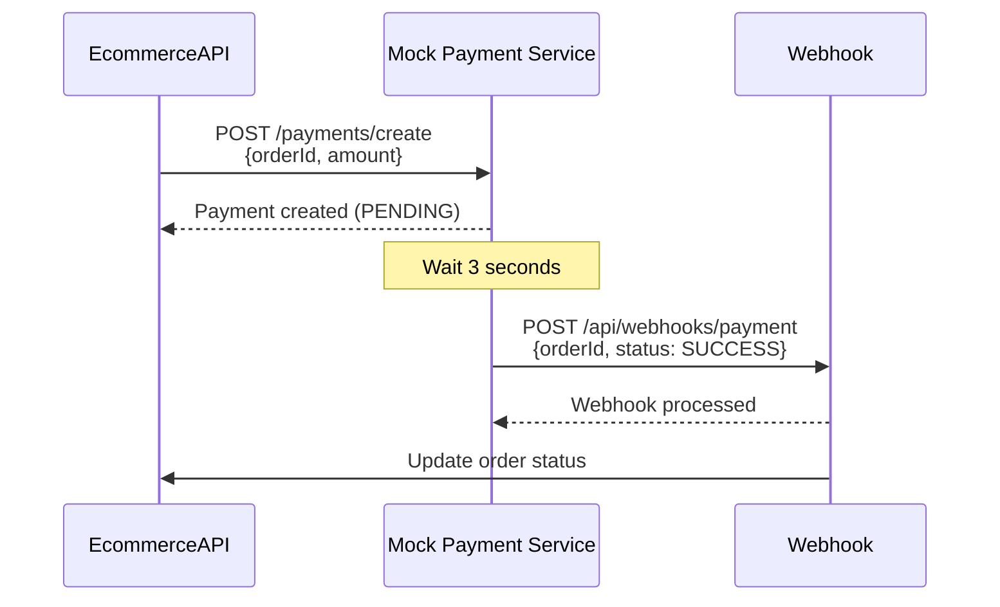

---

## 📝 **Implementation Checklist**

### **Phase 1: Setup (30 minutes)**

- [ ] Create Spring Boot project
- [ ] Add MongoDB dependency
- [ ] Configure `application.yaml`
- [ ] Create folder structure

### **Phase 2: Models & Repositories (45 minutes)**

- [ ] Create User model
- [ ] Create Product model
- [ ] Create CartItem model
- [ ] Create Order model
- [ ] Create OrderItem model
- [ ] Create Payment model
- [ ] Create all repositories

### **Phase 3: Product APIs (30 minutes)**

- [ ] ProductService
- [ ] ProductController
- [ ] POST /api/products
- [ ] GET /api/products
- [ ] Test with Postman

### **Phase 4: Cart APIs (45 minutes)**

- [ ] CartService
- [ ] CartController
- [ ] POST /api/cart/add
- [ ] GET /api/cart/{userId}
- [ ] DELETE /api/cart/{userId}/clear
- [ ] Test with Postman

### **Phase 5: Order APIs (60 minutes)**

- [ ] OrderService
- [ ] OrderController
- [ ] POST /api/orders (from cart)
- [ ] GET /api/orders/{orderId}
- [ ] Test with Postman

### **Phase 6: Payment Integration (90 minutes)**

- [ ] Choose: Razorpay OR Mock Service
- [ ] PaymentService
- [ ] PaymentController
- [ ] POST /api/payments/create
- [ ] WebhookController
- [ ] POST /api/webhooks/payment
- [ ] Test complete flow

### **Phase 7: Testing (30 minutes)**

- [ ] Test all APIs with Postman
- [ ] Verify order flow
- [ ] Verify payment webhook
- [ ] Verify order status update

---

## 🎯 **Grading Criteria**

| Component                     | Points | Criteria                            |
| ----------------------------- | ------ | ----------------------------------- |
| **Product APIs**        | 15     | Create and list products            |
| **Cart APIs**           | 20     | Add, view, clear cart               |
| **Order APIs**          | 25     | Create order from cart, view order  |
| **Payment Integration** | 30     | Payment creation + webhook handling |
| **Order Status Update** | 10     | Order status updates after payment  |
| **Code Quality**        | 10     | Clean code, proper structure        |
| **Postman Collection**  | 10     | Complete Postman collection         |
| **Razorpay Bonus**      | +10    | Razorpay integration (optional)     |

**Total: 100 points (+10 bonus)**

---

## 📊 **Data Flow Diagrams**

### **1. Add to Cart Flow**

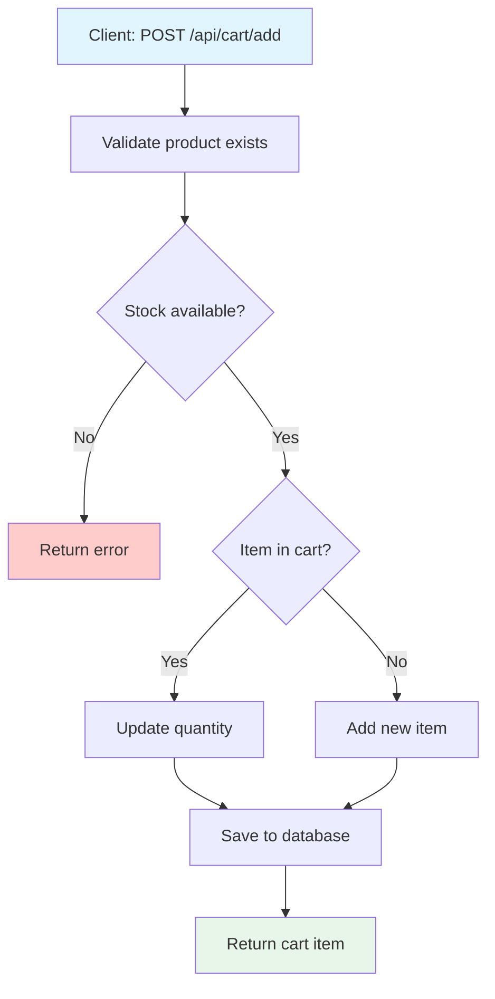

---

### **2. Create Order Flow**

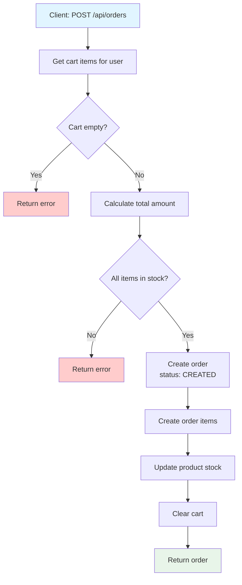

---

### **3. Payment Flow**

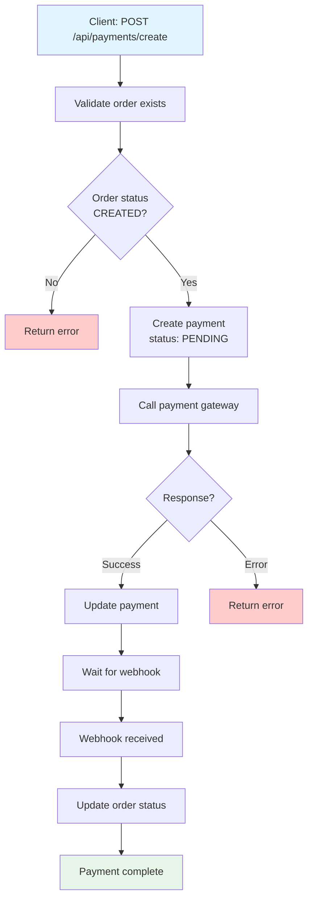

---

## 🧪 **Testing Scenarios**

### **Scenario 1: Complete Purchase Flow**

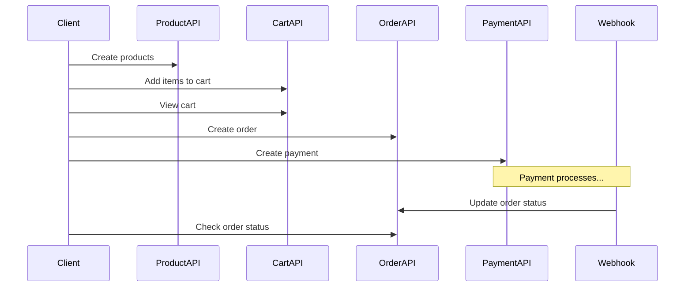

**Test Steps:**

1. Create 2-3 products
2. Add items to cart
3. Create order
4. Initiate payment
5. Wait for webhook
6. Verify order status updated

---

## 📋 **Sample Data**

### **Products to Create**

```json
[
  {
    "name": "Laptop",
    "description": "Gaming Laptop",
    "price": 50000.0,
    "stock": 10
  },
  {
    "name": "Mouse",
    "description": "Wireless Mouse",
    "price": 1000.0,
    "stock": 50
  },
  {
    "name": "Keyboard",
    "description": "Mechanical Keyboard",
    "price": 3000.0,
    "stock": 30
  }
]
```

---

## 🎓 **Key Concepts to Demonstrate**

### **1. Service-to-Service Communication**

- Payment service calls (RestTemplate)
- Webhook callbacks

### **2. Database Relationships**

- One-to-Many (User → Orders)
- Many-to-Many (Order → Products via OrderItem)

### **3. Business Logic**

- Cart to Order conversion
- Stock management
- Order status updates

### **4. Webhook Pattern**

- Async callbacks
- Payment status updates

---

## 📝 **Submission Requirements**

### **1. Code Submission**

- Complete Spring Boot project
- All APIs implemented
- Clean, well-structured code
- Proper error handling

### **2. Postman Collection**

- All endpoints tested
- Sample requests included
- Variables for IDs (userId, orderId, etc.)

### **3. Documentation**

- README with setup instructions
- API documentation
- ER diagram

### **4. Demo Video

- 5-minute demo showing complete flow
- Bonus: +5 points

---

## ⏱️ **Time Allocation**

| Phase           | Time              | Description                        |
| --------------- | ----------------- | ---------------------------------- |
| Setup           | 30 min            | Project setup, dependencies        |
| Models          | 45 min            | Create all models and repositories |
| Product APIs    | 30 min            | Product CRUD                       |
| Cart APIs       | 45 min            | Cart management                    |
| Order APIs      | 60 min            | Order creation and retrieval       |
| Payment         | 90 min            | Payment integration + webhook      |
| Testing         | 30 min            | Postman testing                    |
| **Total** | **5 hours** | Complete implementation            |

---

## 💡 **Tips for Students**

### **1. Start Simple**

- Implement Product APIs first
- Then Cart, then Order, then Payment

### **2. Test Incrementally**

- Test each API as you build it
- Don't wait until the end

### **3. Use Postman Variables**

- Save userId, orderId, productId
- Makes testing easier

### **4. Mock Payment Service**

- Easier than Razorpay
- Still demonstrates webhook pattern
- Can add Razorpay later for bonus

### **5. Error Handling**

- Validate inputs
- Check stock availability
- Handle payment failures

---

## ✅ **Final Checklist**

Before submission, verify:

- [ ] All mandatory APIs implemented
- [ ] Products can be created and listed
- [ ] Items can be added to cart
- [ ] Cart can be viewed and cleared
- [ ] Orders can be created from cart
- [ ] Payment can be initiated
- [ ] Webhook updates order status
- [ ] Order status reflects payment result
- [ ] Postman collection complete
- [ ] Code is clean and documented
- [ ] All APIs tested and working

---

## 🎁 **Bonus Challenges (Optional)**

### **Challenge 1: Order History**

- GET /api/orders/user/{userId}
- List all orders for a user
- **Bonus: +5 points**

### **Challenge 2: Order Cancellation**

- POST /api/orders/{orderId}/cancel
- Cancel order if not paid
- Restore stock
- **Bonus: +5 points**

### **Challenge 3: Product Search**

- GET /api/products/search?q=laptop
- Search products by name
- **Bonus: +5 points**

---

## 📚 **Reference Resources**

### **Spring Boot Documentation**

- Spring Data MongoDB
- RestTemplate Guide
- Webhook Best Practices

### **Razorpay Integration (If Chosen)**

- Razorpay Java SDK
- Webhook Verification
- Test Mode Setup

---
